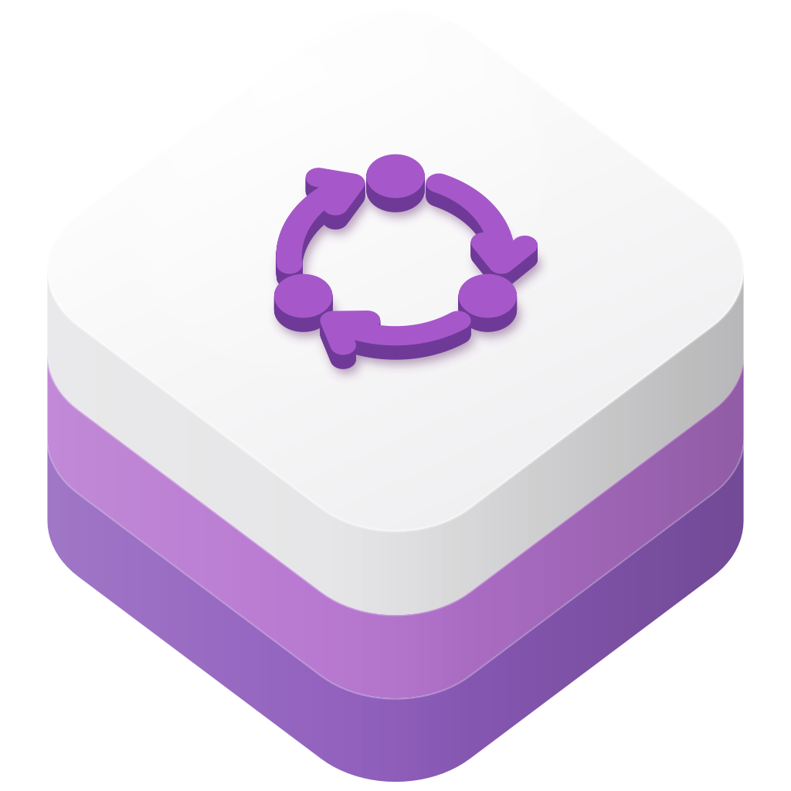

<p align="center">
  
</p>

<h1 align="center">swift-redux</h1>

<p align="center">
  A Redux store for Swift, with actions, reducers, middleware, and state subscriptions.
</p>

<p align="center">
  <a href="https://github.com/swift-library/swift-redux/actions/workflows/ci.yml"></a>
  
  
  <a href="LICENSE.txt"></a>
</p>

[Overview](#overview) · [Install](#install) · [Quick start](#quick-start) ·
[Products](#products) · [Usage](#usage) · [Requirements](#requirements) ·
[Documentation](#documentation) · [Contributing](#contributing) ·
[License](#license)

> [!NOTE]
> swift-redux is pre-1.0. Minor releases may include breaking changes, so
> depend on it with `.upToNextMinor(from:)`.

## Overview

swift-redux brings the Redux pattern to Swift. A `Store` owns the application
state. Code describes each change as an action, a value whose type conforms to
`ActionType`, and sends it with `dispatch(_:)`. A reducer computes the next
state from the action and the current state, middleware sees each action
before the reducer, and subscribers receive each new state.

- `Store<State>`, an open class that holds the state, the reducer, and the
  middleware chain.
- `Reducer<State>`, a function from an action and the current state to the
  next state.
- `Middleware<State>`, curried in the style of Redux middleware in JavaScript.
- Subscriptions with closures or `ListenerType` objects, optionally narrowed by
  a selector.
- Initial state from the reducer, through `BuiltInAction.initialize`, when you
  create a store without one.

## Install

Add the package and the `Redux` product to `Package.swift`:

```swift
dependencies: [
  .package(
    url: "https://github.com/swift-library/swift-redux.git",
    .upToNextMinor(from: "0.1.0")
  ),
],
targets: [
  .target(
    name: "YourTarget",
    dependencies: [
      .product(name: "Redux", package: "swift-redux"),
    ]
  ),
]
```

swift-redux has no dependencies.

## Quick start

Define the state, the actions, and a reducer, then create a store, subscribe to
it, and dispatch actions:

```swift
import Redux

struct CounterState {
  var count = 0
}

enum CounterAction: ActionType {
  case increment
  case decrement
}

let counterReducer: Reducer<CounterState> = { action, state in
  var state = state ?? CounterState()
  switch action {
  case CounterAction.increment:
    state.count += 1
  case CounterAction.decrement:
    state.count -= 1
  default:
    break
  }
  return state
}

let store = Store(state: CounterState(), reducer: counterReducer)
let unsubscribe = store.subscribe { state in
  print("count:", state.count)
}

store.dispatch(CounterAction.increment)
store.dispatch(CounterAction.increment)
store.dispatch(CounterAction.decrement)
unsubscribe()
```

It prints:

```text
count: 0
count: 1
count: 2
count: 1
```

`subscribe(_:)` passes the current state to the listener right away, and every
new state after that. Call the returned `Unsubscribe` closure to stop receiving
updates.

## Products

| Product | Use it for |
| --- | --- |
| `Redux` | The store, actions, reducers, middleware, and subscriptions |
| `ReduxDynamic` | The same modules built as a dynamic library |

Both products contain five modules. `Redux` holds the API described here.
`ReduxShim` declares `ObjCStateType`, an empty protocol that refines
`NSObjectProtocol`. `ReduxDSL`, `ReduxThunk`, and `ReduxComponent` contain no
public API.

## Usage

### Actions and reducers

An action is a value whose type conforms to `ActionType`, a protocol with no
requirements. Enumerations are a natural fit, and their cases can carry
payloads:

```swift
enum TodoAction: ActionType {
  case add(String)
  case remove(index: Int)
}

struct TodoState {
  var items: [String] = []
}

let todoReducer: Reducer<TodoState> = { action, state in
  var state = state ?? TodoState()
  switch action {
  case TodoAction.add(let title):
    state.items.append(title)
  case TodoAction.remove(let index):
    state.items.remove(at: index)
  default:
    break
  }
  return state
}
```

A `Reducer<State>` has the type `(ActionType, State?) -> State`. It receives
every action that the middleware passes on, including
`BuiltInAction.initialize`, so return the state unchanged for actions it does
not handle. When the state is
`nil`, return the initial state.

### Creating a store and dispatching

`Store(state:reducer:middleware:)` takes the initial state, the reducer, and an
optional array of middleware. Pass `nil` as the state, and the store dispatches
`BuiltInAction.initialize` so that the reducer builds the initial state:

```swift
let store = Store(state: nil, reducer: todoReducer)
store.dispatch(TodoAction.add("Write the README"))
print(store.state.items)
```

`dispatch(_:)` passes the action through the middleware and the reducer, then
stores the new state and notifies subscribers, synchronously on the calling
thread. `state` holds the current state.

`Store` is safe to use from several threads. It serializes dispatching,
subscribing, and unsubscribing with a recursive lock: a dispatch from another
thread waits for the current one to finish, and middleware and listeners can
dispatch again on the same thread. A reducer must not dispatch: an action
dispatched while the reducer is running stops the program with a fatal error.
Listeners run while the store holds its lock, so a listener must not block on
another thread that uses the same store, for example with
`DispatchQueue.main.sync`.

### Middleware

A `Middleware<State>` is a curried function,
`(getState) -> (dispatch) -> (next) -> (action) -> Void`. `getState` returns the
current state, `dispatch` sends a new action through the whole chain, and `next`
passes the current action to the next middleware or, at the end of the chain,
to the reducer:

```swift
let logger: Middleware<TodoState> = { getState in
  { dispatch in
    { next in
      { action in
        print("will dispatch:", action)
        next(action)
        print("items:", getState()?.items ?? [])
      }
    }
  }
}

let store = Store(state: TodoState(), reducer: todoReducer, middleware: [logger])
```

Middleware runs in array order. A middleware that does not call `next` stops
the action before it reaches the reducer. Assigning a new array to
`store.middleware` rebuilds the chain.

### Subscribing to state

Subscribe with a closure, or narrow the state with a selector so the listener
receives only the part it needs:

```swift
let unsubscribe = store.subscribe { state in
  print("items:", state.items.count)
}

let unsubscribeCount = store.subscribe({ count in
  print("count:", count)
}, selector: \.items.count)
```

Each listener receives the current state, or the part that its selector picks,
as soon as it subscribes, then again after every action that reaches the
reducer, even when the selected value did not change. The store notifies
listeners in no particular order.

A listener can also be an object that conforms to `ListenerType`, with either
form of `subscribe`:

```swift
final class TodoCounter: ListenerType {
  func newState(_ state: TodoState) {
    print("items:", state.items.count)
  }
}

let counter = TodoCounter()
let unsubscribeCounter = store.subscribe(counter)
```

The store keeps a strong reference to each listener until you call the
`Unsubscribe` closure that `subscribe` returned. After that call, the listener
receives no more states, even if the store is in the middle of notifying
listeners. The closure does not keep the store alive, and calling it again has
no effect.

## Requirements

- Swift 5.7 or later
- macOS 12 or later, iOS 15 or later, watchOS 9 or later, or tvOS 15 or later

## Documentation

- [Module documentation](Sources/Redux/Redux.docc/Redux.md):
  the public API reference and module overview.

- [CHANGELOG.md](CHANGELOG.md) lists notable changes, including changes to
  the public API.
- Doc comments in the source describe `Store`, its protocols, and
  `Middleware`, and Xcode shows them in Quick Help.
- The [Redux documentation](https://redux.js.org) explains the pattern that
  swift-redux follows.

## Contributing

Read [CONTRIBUTING.md](CONTRIBUTING.md) before opening a pull request, and run
`Scripts/check` to check your changes. This project follows the
[code of conduct](CODE_OF_CONDUCT.md). Releases follow the swift-library
[versioning standard](https://github.com/swift-library/.github/blob/master/VERSIONING.md).

## License

swift-redux is available under the Apache License 2.0 with the Swift Runtime
Library Exception. See [LICENSE.txt](LICENSE.txt) and [NOTICE](NOTICE).
